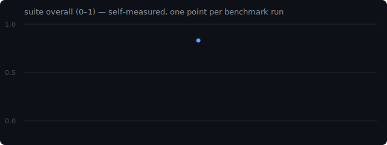

# reinsman

> A self-hosted **agent harness** — throw one HTTP *goal* at it and a 24/7 central
> orchestrator (Claude, opus) carries it out autonomously: spawning sub-agents,
> looping *make → observe → score → retry* until its own evaluator signs off, and
> persisting what it learns into a local Obsidian-style knowledge graph.

**Agent = Model + Harness.** This repo is the *harness*: the loop, tool dispatch,
context management, memory, observability, and safety scaffolding around the model.

<p align="center">
  
</p>

```
HTTP POST /goal  ──▶  central orchestrator (reinsman/runtime/orchestrator.py)
                        │  spawn_agent / build_loop / spawn_parallel
                        ├──▶ sub-agent ─(done)→ runtime md auto-deleted
                        ├──▶ sub-agent ─(done)→ ...
                        └──▶ ...
                     results → task_store(JSON) + traces/ + knowledge/
HTTP GET /tasks/{id} ──▶ progress / result
```

## 🧾 This project's launch was run *by* the agent

The promo for reinsman wasn't written by a human about the tool — it was submitted to the tool as **one
goal** and executed autonomously (research → skeptic self-critique → asset build), leaving a
machine-verifiable, **one-command-reproducible** trail in [`docs/self-run-launch/`](docs/self-run-launch/).
Don't trust the pitch — **verify it** against the code, then re-run the launch yourself.
Measured, not marketing (e.g. context isolation cut an identical task **$3.74 → $1.42, −62%**); star/user
counts are deliberately not claimed.

## Features
- **Central orchestrator loop** with auto-resume on turn exhaustion (`reinsman/runtime/orchestrator.py`)
- **Dynamic sub-agents** from cited prompt templates (`reinsman/runtime/agent_factory.py`, `templates/`)
- **Verify loop** (`build_loop`) — a closed *make → observe → score → retry* cycle
  (planner → executor → evaluator) with best-round snapshot restore. The current observer is
  screenshots (web/file artifacts); pluggable observers — test runs, LLM judges, live metrics —
  are on the roadmap below
- **Persistent knowledge graph** — `save_knowledge` writes an Obsidian-compatible vault
  (`knowledge/`, `[[wikilinks]]` + auto Index/Graph)
- **Channels** — chat front via messengers, decoupled from the engine (`channels/`, Telegram bridge included)
- **Observability** — per-task tracing + LLM-judge evaluation (`tracing.py`, `evaluation.py`)
- **Scheduler** — recurring routines submitted as goals (`routines.py`)

## 📈 It benchmarks itself — and keeps the receipts

On a schedule, the harness re-runs a fixed goal suite ([`benchmarks/suite/`](benchmarks/suite/)),
scores each run with its **own LLM judge**, and commits the scores, trace ids, and progress
curve to [`benchmarks/LEDGER.md`](benchmarks/LEDGER.md). Improvements *and regressions* both
stay on the public record — every number maps to a replayable trace, none are hand-written
(see [`benchmarks/run_suite.py`](benchmarks/run_suite.py)). To reproduce: start the server and run

```bash
python benchmarks/run_suite.py
```

<p align="center"></p>

## ⭐ Star-Fueled Development — your star makes the agent work

A GitHub star is usually applause. Here it's **fuel**: every 10 new stars automatically
unlock one autonomous run — the harness picks the top-👍 [`goal` issue](../../issues?q=is%3Aissue+is%3Aopen+label%3Agoal),
executes it, and commits the result with the unlock number and a replayable trace id
([`starfuel/LEDGER.md`](starfuel/LEDGER.md)). Propose a goal, vote with 👍, star to fire.

<p align="center"></p>

Fair-play notes: stars are voluntary and unrewarded (nothing of value is given to any
individual for starring); goals are restricted to improving this repository, behind the
orchestrator's safety guard; unlocks are recorded by [`star_fuel.py`](starfuel/star_fuel.py),
never hand-written.

## Roadmap — self-evolving harness
The direction is not a feature-list race but a harness that **improves itself from evidence**
(own traces/evals → proposals → A/B → gated apply). In priority order:

1. **ecosystem-watch** — a weekly routine that scans agent-ecosystem releases/trends and files
   improvement proposals (diff drafts) for the gate; never auto-applied
2. **Skill distillation** — compile successful goal traces into reusable skills (SOP + tool scripts)
3. **`self_improve` at code level** — extend the existing propose/apply/revert gate from prompts
   to harness code and tools; the [self-benchmark ledger](benchmarks/LEDGER.md) (already live)
   is the regression gate for this
4. **Verify-loop generalization** — factor the observer out of `build_loop` into plugins
   (screenshots today; test runs, LLM judges, live metrics next), so the same loop verifies any
   kind of artifact

## Quick start

Via pip (data home is seeded to `~/.reinsman` on first run):
```bash
pip install reinsman
reinsman                  # serves on 127.0.0.1:8848
```

Or from source:
```bash
python -m venv .venv && . .venv/bin/activate   # Windows: .\.venv\Scripts\Activate.ps1
pip install -r requirements.txt
cp .env.example .env        # then edit (see below)
python -m reinsman        # serves on 127.0.0.1:8848
```
Then open **http://127.0.0.1:8848** in your browser — a built-in chat UI is served there,
so you can talk to the agent immediately (no extra setup).

Authentication: either set `ANTHROPIC_API_KEY` in `.env`, or log in with the Claude
Code CLI (leave the key blank and the SDK follows the CLI session).

Not sure what to try first? See [Example goals](docs/EXAMPLE_GOALS.md) — from 30-second sanity checks to walk-away missions.

Prefer the API? Submit a goal directly:
```bash
curl -s http://127.0.0.1:8848/goal \
  -H 'content-type: application/json' \
  -d '{"goal": "create hello.txt in workspace with hi"}'
```

## Run as a desktop app (auto-start)
Treat it like an always-on app instead of a terminal command.

**Native window** — run it as a real program window (no browser). It starts the server and
shows the chat + routines UI in a native window (Windows uses the built-in Edge WebView2):
```bash
pip install pywebview          # for the native window
python -m reinsman.app       # opens the app window (falls back to browser if pywebview is missing)
```

**Single .exe** — package the native-window app into one executable:
```powershell
powershell -NoProfile -ExecutionPolicy Bypass -File packaging\build_exe.ps1   # -> dist\reinsman.exe
```
This build **does not include Claude** — Claude Code is Anthropic's proprietary software and is not
bundled or redistributed here. The `.exe` requires Claude to be present at runtime (an
`ANTHROPIC_API_KEY`, or the Claude Code CLI on PATH). On first run it seeds `~/.reinsman`
(templates / agents / knowledge / `.env`). For most use, just **run from source / the app launcher**
above with your own Claude — that's the simplest way to test.

**Tray launcher** — instead of a window, keep it in the tray (Open / Restart / Quit):
```bash
pip install pystray pillow          # optional — enables the tray icon
python -m reinsman.tray
```
Without `pystray`/`pillow` it still starts the server and opens the browser (Ctrl+C to stop).

**Auto-start at logon (Windows)** — register a hidden watchdog task that launches the
server whenever you log in (and restarts it if it exits):
```powershell
powershell -NoProfile -ExecutionPolicy Bypass -File scripts\autostart.ps1 -Install
powershell -NoProfile -ExecutionPolicy Bypass -File scripts\autostart.ps1 -Uninstall   # to remove
```
(macOS/Linux: run `python -m reinsman.tray` from your login items, or wrap `run.ps1`'s
equivalent in a `systemd --user` / `launchd` unit.)

Note: even as an app, each user still authenticates once (`ANTHROPIC_API_KEY` in `.env`
or a Claude CLI login) — credentials are never bundled.

## Use it from other agents (MCP)
reinsman ships as an **MCP server**, so any MCP client (Claude Code, Claude Desktop, …)
can hand it long-running goals and keep working while the harness executes:

```bash
pip install "reinsman[mcp]"
claude mcp add reinsman -- reinsman-mcp     # Claude Code one-liner
```

Tools exposed: `submit_goal` (returns a task_id immediately), `get_task` (progress /
result / recent events), `list_tasks`. The bridge talks to your running server
(`REINSMAN_URL`, default `http://127.0.0.1:8848`) — an assistant delegates the
hours-long work and collects the traced, evaluated result later.

## Chat UI & channels
The **built-in web chat** (served at `/`) is the zero-setup way to use the harness —
just run the server and open the browser. It posts to `/goal` and streams live progress.

For remote/mobile use, an optional **Telegram bridge** reuses an existing chat app as the
UI (no custom frontend, conversations resume across devices):
```bash
# .env: TELEGRAM_BOT_TOKEN=...  TELEGRAM_ALLOWED_CHAT_IDS=<your chat id>
python -m reinsman.channels.telegram_bridge            # live
python -m reinsman.channels.telegram_bridge --dry-run  # logic self-test, no token needed
```

## Layout
Source lives in the `reinsman/` package, grouped by type; data/prompt folders stay at the repo root.

| Path | Role |
|---|---|
| `reinsman/__main__.py` | entry point (`python -m reinsman`) |
| `reinsman/config.py` · `applog.py` | configuration & logging |
| `reinsman/runtime/` | `server` (FastAPI), `orchestrator`, `agent_factory` (spawn + `build_loop`), `routines`, `self_improve` |
| `reinsman/prompts/` | `agent_loader`, `template_engine` |
| `reinsman/kb/` | `knowledge_store` (persistent wiki) |
| `reinsman/observability/` | `tracing`, `evaluation`, `viewer` |
| `reinsman/storage/` | `task_store` |
| `reinsman/channels/` | messenger adapters (chat front, e.g. Telegram) |
| `reinsman/tools/` | agent-callable tools (e.g. `publish`) |
| `agents/` · `templates/` | agent definitions & cited prompt templates (`.md`) |
| `knowledge/` | persistent Obsidian-style knowledge vault (empty scaffold here) |
| `tools/screenshot/` | standalone Playwright screenshot scripts |

## Safety
This harness can run with broad autonomy (`PERMISSION_MODE`). Before exposing it to a
channel or desktop control, restrict senders (`TELEGRAM_ALLOWED_CHAT_IDS`), keep
`PERMISSION_MODE` appropriate, and **never commit secrets or personal data** — see
[SECURITY.md](SECURITY.md). All secrets live in `.env` (git-ignored).

## Requirements & third-party notice
This is a **harness only**. It requires access to **Claude** to do anything — provide an
`ANTHROPIC_API_KEY`, or sign in with the Claude Code CLI. **Claude Code is Anthropic's proprietary
software and is not included or redistributed by this project**; each user brings their own access,
subject to Anthropic's terms. The prompt templates cite their public sources (see `templates/README.md`).

## License
MIT — see [LICENSE](LICENSE). The MIT license covers this repository's own code only, not Claude
or any third-party software you install to run it.

<!-- mcp-name: io.github.201924611/reinsman -->
